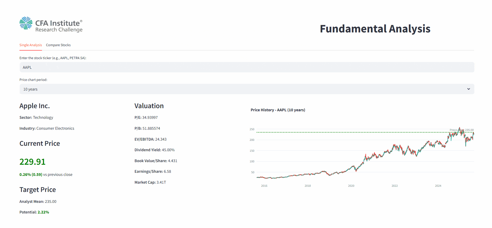

## 📈 Fundamental Analysis — EN

Real-time stock dashboard to view fundamentals, charts, company comparisons, and valuation signals. Built with Streamlit + Plotly and Yahoo Finance (`yfinance`) as the data source.

🏆 **Award**: Winner — recognized with distinction by President Marcia Sadzevicius, CFA, São Paulo, in the CFA Institute Research Challenge.

### 🔍 Features
- Single-ticker lookup (e.g., AAPL, PETR4.SA) with sector/industry context
- Multi-company comparison with CSV export
- Valuation, efficiency, leverage, and profitability indicators (P/E, P/B, EV/EBITDA, margins, ROE/ROA/ROIC, debt ratios)
- Target price and price history charts (1y, 5y, 10y), including analyst mean target and upside
- Full fundamental tables: Income Statement, Balance Sheet, Cash Flow (last reported periods)
- Interactive UI (Plotly candlesticks and comparison lines) with custom styling

### 🤖 Tech/Methods in this app
- Data ingestion: `yfinance` (Yahoo Finance) on demand
- Computed ratios and margins from provider fundamentals
- Visualization: Plotly (candlesticks, line comparisons) inside Streamlit tabs
- UI/UX: custom CSS, metric cards, CSV export for comparisons

### 📡 Data
- Yahoo Finance via `yfinance`
- Market data fetched on demand

---

## 📈 Análise Fundamentalista — PT-BR

Dashboard em tempo real para fundamentos, gráficos, comparação de empresas e sinais de valuation. Construído com Streamlit + Plotly e dados do Yahoo Finance (`yfinance`).

🏆 **Premiação**: Vencedor — reconhecido com distinção pela President Marcia Sadzevicius, CFA, São Paulo, no CFA Institute Research Challenge.

### 🔍 Funcionalidades
- Consulta individual de ticker (ex.: AAPL, PETR4.SA) com setor/indústria
- Comparação de múltiplas empresas com exportação CSV
- Indicadores de valuation, eficiência, alavancagem e rentabilidade (P/L, P/VPA, EV/EBITDA, margens, ROE/ROA/ROIC, endividamento)
- Gráficos de preço e preço-alvo (1 ano, 5 anos, 10 anos), incluindo alvo médio de analistas e potencial
- Tabelas fundamentais: DRE, Balanço, Fluxo de Caixa (últimos períodos reportados)
- Interface interativa (candles e linhas no Plotly) com estilo customizado

### 🤖 Técnicas usadas aqui
- Ingestão de dados: `yfinance` (Yahoo Finance) sob demanda
- Cálculo de múltiplos e margens a partir dos fundamentos do provedor
- Visualização: Plotly (candlesticks, linhas comparativas) em abas do Streamlit
- UI/UX: CSS customizado, cards de métricas, exportação CSV para comparações

### 📡 Dados
- Yahoo Finance via `yfinance`
- Dados de mercado obtidos sob demanda