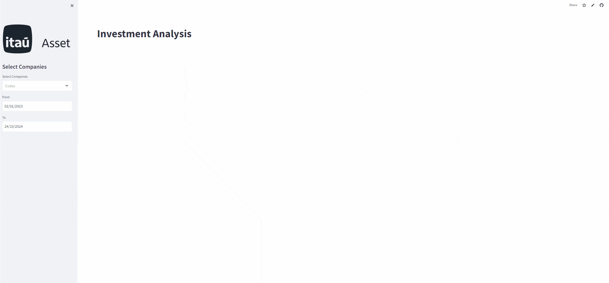

# 📊 Itaú Quantamental Challenge — EN

App for quantitative analysis of B3 stocks, including risk–return metrics and benchmark comparison.



## Award
🏆 **Award**: Winner — recognized with distinction by President Marcia Sadzevicius, CFA, São Paulo, in the CFA Institute Research Challenge.

## Overview
This Streamlit app lets you select B3 tickers, pull adjusted close prices from Yahoo Finance, and visualize relative performance, portfolio metrics, and a risk–return (vol/return) scatterplot versus the IBOV index.

## Features
- 🔎 Ticker selection (B3) with IBOV benchmark.
- 🗓️ Custom date range input.
- 📈 Relative performance chart (rebased to 100).
- ⚖️ Risk–Return scatterplot with Sharpe coloring.
- 📊 Metric cards for return and annualized volatility.
- 🧮 Equal-weight portfolio vs. IBOV.

## Tech Stack / Dependencies
- **Streamlit**: UI and layout.
- **Pandas**: Data handling and transformations.
- **NumPy**: Numerical calculations (returns, volatility).
- **yfinance**: Market data (prices, logos when available).
- **Plotly Express**: Interactive charts (scatterplot).
- **streamlit-extras**: Metric cards styling and grid layout.
- **Requests**: HTTP utilities (kept for possible external fetches).

## Requirements
- Python 3.9+ recommended
- Packages: `streamlit`, `pandas`, `numpy`, `yfinance`, `plotly`, `requests`, `streamlit-extras`

## Installation
```bash
pip install -r requirements.txt
```

## Running the app
```bash
streamlit run app.py
```

## Usage
1. Upload/ensure `tickers.csv` is present (ticker codes in the second column, zeros removed).
2. Open the app and pick tickers (they’re suffixed with `.SA` automatically).
3. Set the date range and load data.
4. Explore:
   - Metric cards: return and annualized volatility per ticker/portfolio/IBOV.
   - Relative performance line chart (rebased).
   - Risk–Return scatterplot (color = Sharpe proxy).

## Data Source
- Yahoo Finance (`yfinance`)

## Notes
- Logos are fetched via `yfinance`’s `logo_url` when available; otherwise a fallback icon is used.
- IBOV is pulled as `^BVSP`.
- A simple equal-weight portfolio is computed from selected tickers.

---

# 📊 Itaú Quantamental Challenge — PT-BR

Aplicativo para análise quantitativa de ações da B3, com métricas de risco-retorno e comparação com o índice IBOV.


## Premiação
🏆 **Premiação**: Campeão — reconhecido com distinção pela Presidente Marcia Sadzevicius, CFA, em São Paulo, no CFA Institute Research Challenge.

## Visão geral
Este app em Streamlit permite selecionar tickers da B3, buscar preços ajustados no Yahoo Finance e visualizar performance relativa, métricas de portfólio e um gráfico de risco–retorno (vol/retorno) em relação ao IBOV.

## Funcionalidades
- 🔎 Seleção de tickers (B3) com benchmark IBOV.
- 🗓️ Faixa de datas configurável.
- 📈 Gráfico de performance relativa (base 100).
- ⚖️ Dispersão de Risco–Retorno com coloração por Sharpe.
- 📊 Cards de métricas de retorno e volatilidade anualizada.
- 🧮 Portfólio igualmente ponderado vs. IBOV.

## Tecnologias / Dependências
- **Streamlit**: Interface e layout.
- **Pandas**: Manipulação e transformação dos dados.
- **NumPy**: Cálculos numéricos (retornos, volatilidade).
- **yfinance**: Dados de mercado (preços e, quando disponível, logos).
- **Plotly Express**: Gráficos interativos (dispersão).
- **streamlit-extras**: Estilo de metric cards e layout em grid.
- **Requests**: Utilidades HTTP (mantido para usos externos).

## Requisitos
- Python 3.9+ recomendado
- Pacotes: `streamlit`, `pandas`, `numpy`, `yfinance`, `plotly`, `requests`, `streamlit-extras`

## Instalação
```bash
pip install -r requirements.txt
```

## Execução
```bash
streamlit run app.py
```

## Como usar
1. Garanta que `tickers.csv` está presente (códigos na segunda coluna, zeros removidos).
2. Abra o app e escolha os tickers (sufixo `.SA` é adicionado automaticamente).
3. Defina a janela de datas e carregue os dados.
4. Explore:
   - Cards: retorno e volatilidade anualizada por ticker/portfólio/IBOV.
   - Gráfico de performance relativa (base 100).
   - Gráfico de dispersão Risco–Retorno (cor = proxy de Sharpe).

## Fonte de dados
- Yahoo Finance (`yfinance`)

## Observações
- Logos são buscados pelo `logo_url` do `yfinance`; caso ausentes, é usado um ícone de fallback.
- IBOV é obtido como `^BVSP`.
- O portfólio igualmente ponderado é calculado a partir dos tickers selecionados.