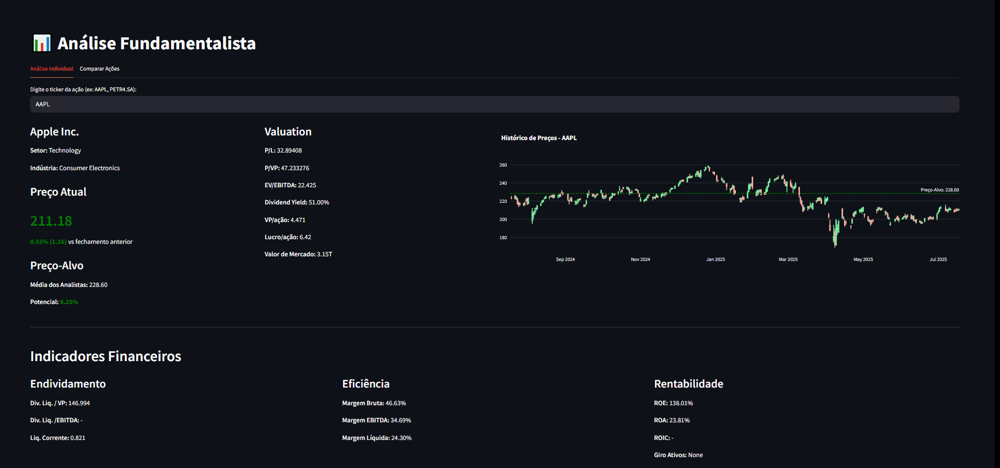

# 📈 Fundamental Analysis

Dashboard for real-time stock analysis. Enables visualization of financial indicators, charts, company comparisons, and valuation analysis.

## 🔍 Features

- Individual stock lookup (e.g., AAPL, PETR4.SA, etc.)
- Multi-company comparison
- Valuation, efficiency, leverage, and profitability indicators  
- Target price charts  
- Complete fundamental tables (Income Statement, Balance Sheet, Cash Flow)  
- CSV download for comparisons  
- Interactive interface

## 📡 Data Sources

- [Yahoo Finance](https://finance.yahoo.com/) via `yfinance`  
- Financial data updated automatically

---

🏆 **Award for Investment Research Excellence**

This project was recognized at the CFA Institute Research Challenge.