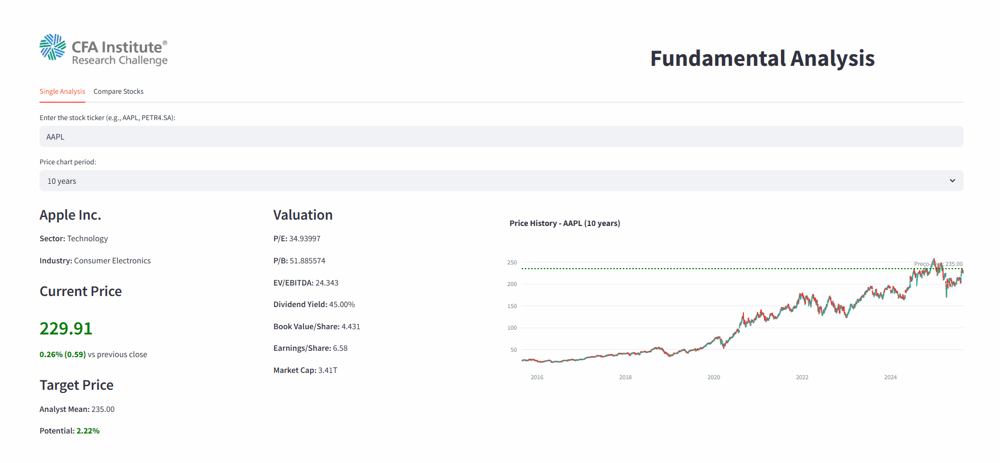

# 📈 Análise Fundamentalista

Dashboard interativo para analisar ações em tempo real. Permite visualização de indicadores financeiros, gráficos, comparações entre empresas e análise de valuation.

## 🔍 Funcionalidades

- Consulta individual de ações (ex: AAPL, PETR4.SA, entre outras) 
- Comparação entre múltiplas empresas
- Indicadores de valuation, eficiência, endividamento e rentabilidade  
- Gráficos com preço-alvo  
- Tabela fundamentalista completa (DRE, Balanço, Fluxo de Caixa)  
- Download em CSV para comparações  
- Interface interativa

## 📡 Fontes de Dados

- [Yahoo Finance](https://finance.yahoo.com/) via `yfinance`  
- Dados financeiros atualizados automaticamente